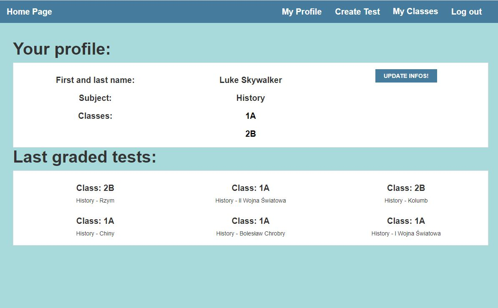

# Python-Django-School-Managment-System
Django based web app. Main functions: cataloging students, planing tests, grading tests, calculating student's mean from grades. Possible new functions to add in future: form teacher and larger possibilities for him, adding a timetable for student, adding a test function, to actually create tests for students.
Views:

